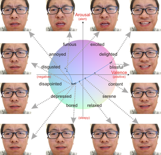

# Dimensional-Emotion-Analysis-of-Facial-Expression

[[project page](http://www.ics.uci.edu/~skong2/DimensionalEmotionModel.html "dimensional-emotion-analysis")]
[paper]
[[demos](https://drive.google.com/open?id=1CVP12ex9q93PsTeredR2nvrMslNubLLk "demos")]
[[video](https://www.youtube.com/watch?v=tVYW9hxgCho&feature=youtu.be "video demo")]
[[models](https://drive.google.com/open?id=1W26vVDWWMgKQGxYx7y0ljng8E-Vb2LPY)]
[[data](https://drive.google.com/open?id=1s79cTqa9ftVfynUk0uZdQZUElozsaQ6l)]
[[result](https://drive.google.com/open?id=1LnkGEQaMYeBIJap_lpRHjgd8VkGNbfr-)]




Shu Kong, last update: 05/02/2018, aimerykong At g-m-a-i-l dot com


Automated facial expression analysis has a variety of applications in human-computer interaction. Traditional methods mainly analyze prototypical facial expressions of no more than eight discrete emotions as a classification task. However, in practice, spontaneous facial expressions in naturalistic environment can represent not only a wide range of emotions, but also different intensities within an emotion family. In such situation, these methods are not reliable or adequate. In this paper, we propose to train deep convolutional neural networks (CNNs) to analyze facial expressions explainable in a dimensional emotion model. The proposed method accommodates not only a set of basic emotion expressions, but also a full range of other emotions and subtle emotion intensities that we both feel in ourselves and perceive in others in our daily life. Specifically, we first mapped facial expressions into dimensional measures so that we transformed facial expression analysis from a classification problem to a regression one. We then tested our CNN-based methods for facial expression regression and these methods demonstrated promising performance. Moreover, we improved our method by a bilinear pooling which encodes second-order statistics of features. We showed such bilinear-CNN models significantly outperformed their respective baselines. 


**Keywords**  Dimensional Emotion Model, Fine-Grained Analysis, Facial Expression, High-Order Correlation, Psychology, Affective-Cognitive Computing, Physiological Computing.


Please download our trained models from [google drive](https://drive.google.com/open?id=1W26vVDWWMgKQGxYx7y0ljng8E-Vb2LPY); replace the empty folder ``models'' with new one which is the whole downloaded directory.

The dataset in the dimensional emotion space can be downloaded in this [google drive](https://drive.google.com/open?id=1s79cTqa9ftVfynUk0uZdQZUElozsaQ6l).

All the results reported in the paper can be found in this [google drive](https://drive.google.com/open?id=1LnkGEQaMYeBIJap_lpRHjgd8VkGNbfr-).


MatConvNet is used in our project; please compile it under folder ``libs'' accordingly --
```python
LD_LIBRARY_PATH=/usr/local/cuda/lib64:local matlab 

path_to_matconvnet = './libs/matconvnet-1.0-beta23';
run(fullfile(path_to_matconvnet, 'matlab', 'vl_setupnn'));
addpath(fullfile(path_to_matconvnet, 'matlab'));
vl_compilenn('enableGpu', true, ...
               'cudaRoot', '/usr/local/cuda', ...
               'cudaMethod', 'nvcc', ...
               'enableCudnn', true, ...
               'cudnnRoot', '/usr/local/cuda/cudnn/lib64') ;

```


